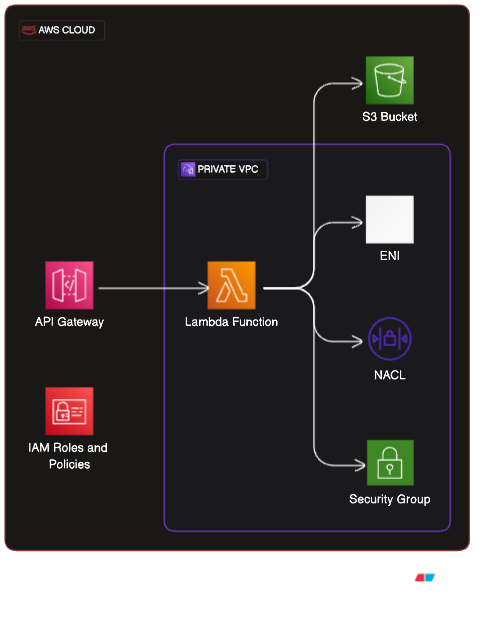

# Deployment Setup

## Prerequisites

1. Install Terraform: Make sure you have Terraform installed on your local machine. You can download Terraform from the official website: https://www.terraform.io/downloads.html

2. AWS Account: You will need an AWS account to create resources using Terraform. If you don't have an account, you can sign up for a free tier account at https://aws.amazon.com/free/

3. AWS CLI: Install and configure the AWS CLI on your local machine. The AWS CLI will be used to create the IAM user for Terraform. You can download it from https://aws.amazon.com/cli/ and review instructions to work with [environment variables](https://docs.aws.amazon.com/cli/latest/userguide/cli-configure-envvars.html)

## Setup Terraform IAM User

1. Open the AWS Management Console and navigate to the IAM (Identity and Access Management) service.

2. Create a new user with programmatic access. Give the user a descriptive name, such as `tf-deploy`.

3. Choose "Attach existing policies directly" and search for the "AdministratorAccess" policy. For production environments, consider granting more restrictive policies based on your requirements.

4. Once the user is created, note down the "Access Key ID" and "Secret Access Key". These credentials to configure the AWS CLI but ensure to store this in a secured vault with proper access for future uses.

5. Configure AWS CLI on your local machine using the credentials obtained in the previous step. We will be leveraging environment variables.

```bash
export AWS_ACCESS_KEY_ID=<AWS_ACCESS_KEY_ID>
export AWS_SECRET_ACCESS_KEY=<AWS_SECRET_ACCESS_KEY>
export AWS_DEFAULT_REGION=<AWS_DEFAULT_REGION>
```
## File structure
```
.
├── 0-providers.tf
├── 0-variables.tf
├── 1-vpc.tf
├── 2-bucket.tf
├── 3-lambda.tf
├── 4-apigw.tf
├── README.md
├── TFDOC.md
├── app
│   └── app.py
├── backend 
│   ├── 0-providers.tf
│   ├── 0-variables.tf
│   ├── 1-bucket.tf
│   ├── 2-state.tf
│   └── TFDOC.md
├── image.png
└── init.sh                # Backend deployment script and initialization script
```

### Setup Backend

To setup the backend run the `init.sh` script in the repo, this will leverage the `backend` folder terraform script to create a bucket and setup `0-backend.tf` file for consumption in the actual IaC folder.
Ensure to update the `reqion` in the `terraform.tfvars-example` and create a `terraform.tfvars` file from it in the backend directory.

```
cp backend/terraform.tfvars-example backend/terraform.tfvars
nano backend/terrform.tfvars # or vi or any editor of choice
```
Similarly to the backend setup ensure to update the tfvars to suite the desired need.

```
cp terraform.tfvars-example terraform.tfvars
nano terrform.tfvars # or vi or any editor of choice
```

Then run the initialization script

```bash
./init.sh init
```

### Deploy Infrastructure

```bash
terraform apply -auto-approve=true  # or terraform plan first then apply if you want
```
This should output the required URL to visit validate that the REST API is functional

### Destroying the Infrastructure

>**This will destroy the entire setup**: Be very careful here!!!

```bash
./init.sh destroy # and follow the prompt
```

> **_NOTE:_**  If no changes are made to the code, the infrastructure will be deployed in ca-central1.<br>
Destroying the intra_subnet and security groups can take about 5-8 mins and a warning can pop-up if a default NACL exist.

## Architecture Overview

The terraform script will:

- Create an S3 bucket and upload a JSON file with the content to be queried.
- Retrieve the S3 bucket name and the object file name.
- Create a VPC with intra_subnets with the desired permissions, security groups, NACL and endpoint access for S3
- Create an AWS Lambda function that reads the JSON file from the S3 bucket using the AWS SDK inside the VPC with IAM roles to enable ENI
- Create an API Gateway endpoint with a GET method that triggers the Lambda function.

When a request is made to the API endpoint, the Lambda function will retrieve the JSON file from S3 and return it as the response.



## Terraform Docs
[Backend](./backend/TFDOC.md)
[REST Infrastructure](./TFDOC.md)